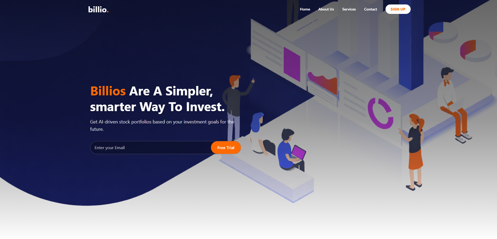
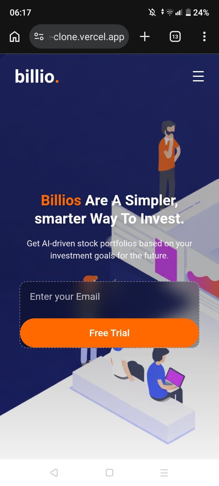

# billio. — Investment Landing Page Clone 

A fully responsive **landing page clone of Billio**, an AI-driven investment platform. Built with **React, Tailwind CSS, and Framer Motion**.

## 🚀 Live Demo
[billio-landing-page-clone.vercel.app](https://billio-landing-page-clone.vercel.app/)

## 📸 Preview




## ✨ Features

- Responsive Design — Mobile-first layout that works across all screen sizes
- Smooth Navigation — Animated navbar with scroll-to-section behavior and mobile hamburger menu (Framer Motion)
- Hero Section — Full-screen background image with email capture and free trial CTA
- About, Services, Contact Sections — Clean layout with form validation and user feedback
- Product Breakdown — Alternating image/text cards with hover effects
- Philosophy Section — Full-width background image with overlay text
- Testimonials — Client feedback section with avatars
- Early Access Card — Email capture with wave SVG transition
- Why We Exist — Icon grid on dark background
- Footer — Multi-column footer with back-to-top
- Sign Up Modal — Overlay modal with password confirmation and login state management

## 🛠️ Built With

- React (Component-based UI)
- Tailwind CSS (Utility-first styling)
- Vite (Fast development and build tooling)
- JavaScript (ES6+)

## 📂 Project Structure

```
src/
├── assets/
│   └── img/              # All section images
├── components/
│   ├── Navbar.jsx        # Fixed navbar with scroll + mobile menu
│   ├── Hero.jsx          # Hero section with email CTA
│   ├── About.jsx         # About Us section
│   ├── Services.jsx      # Services grid
│   ├── Contact.jsx       # Contact form with validation
│   ├── Products.jsx      # Product Breakdown cards
│   ├── Philosophy.jsx    # Philosophy banner section
│   ├── Feedback.jsx      # Client testimonial
│   ├── Card.jsx          # Early access CTA card
│   ├── Box.jsx           # "Why We Exist" section
│   ├── Footer.jsx        # Site footer
│   └── SignUp.jsx        # Sign up modal
├── App.jsx
└── main.jsx
```

## ⚡ Getting Started

1. Clone the repository

```bash
git clone https://github.com/MuqtasidBhatti/billio-landing-page-clone.git
```

2. Navigate into the project

```bash
cd billio-landing-page-clone
```

3. Install dependencies

```bash
npm install
```

4. Run the development server

```bash
npm run dev
```

Open in browser

```
http://localhost:5173
```

Build for Production

```bash
npm run build
```

## 🧠 What I Learned

- Implementing smooth scroll-to-section navigation with offset adjustment for fixed navbars
- Managing mobile menu open/close state with Framer Motion AnimatePresence
- Handling form validation and auto-clearing feedback messages with useEffect and setTimeout
- Building SVG wave transitions between sections for seamless visual flow
- Structuring a multi-section single-page app with clean component separation

## 👨‍💻 Author

**Muqtasid Bhatti**

GitHub:  
https://github.com/MuqtasidBhatti

LinkedIn:  
https://www.linkedin.com/in/muqtasid-bhatti-230525384/

---

⭐ If you like this project, consider giving it a star!